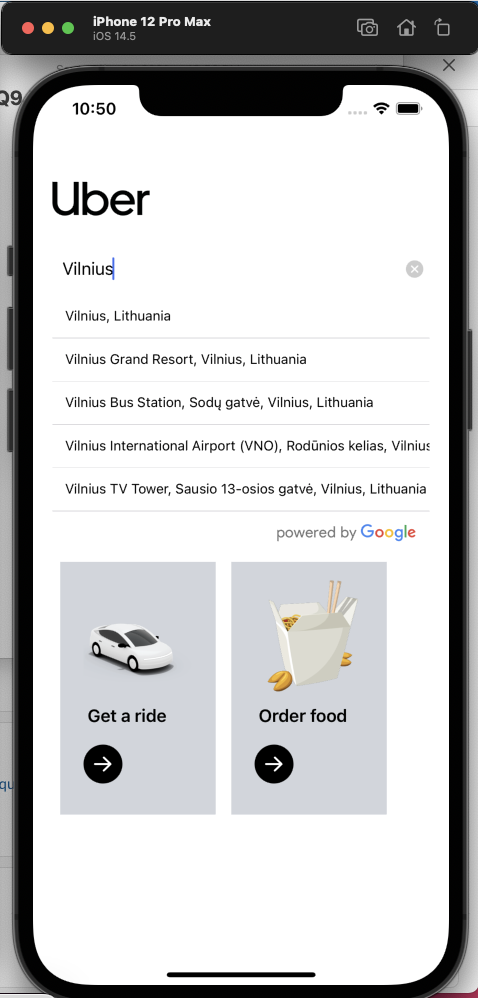
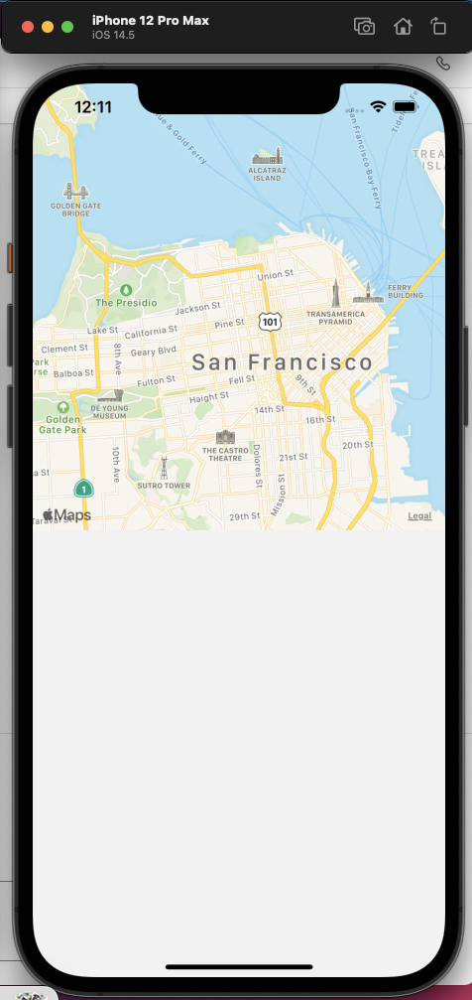
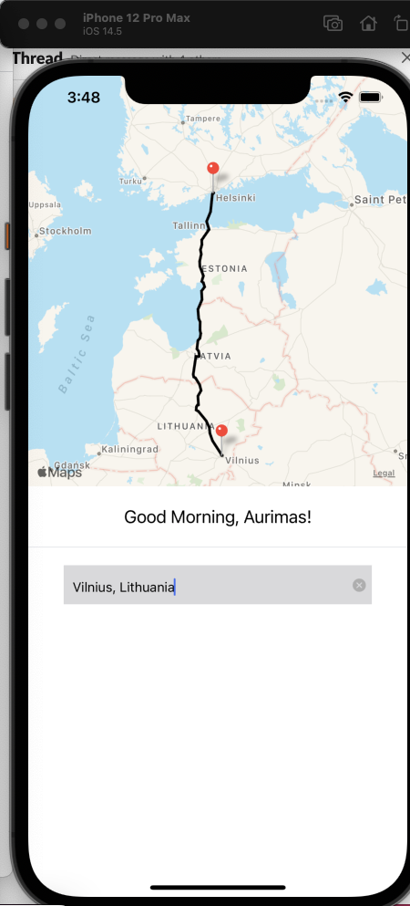
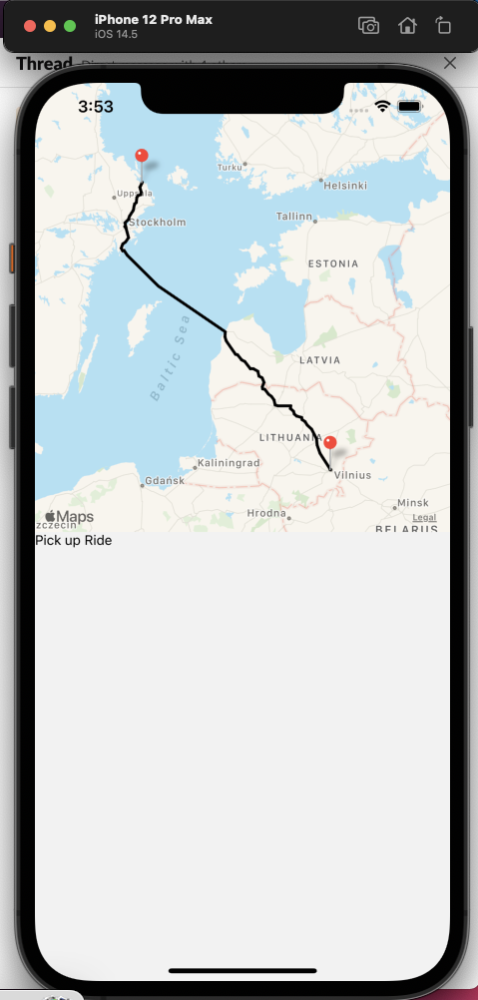
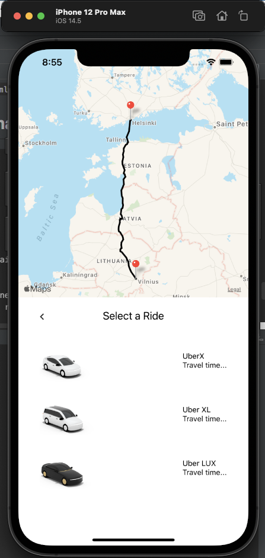
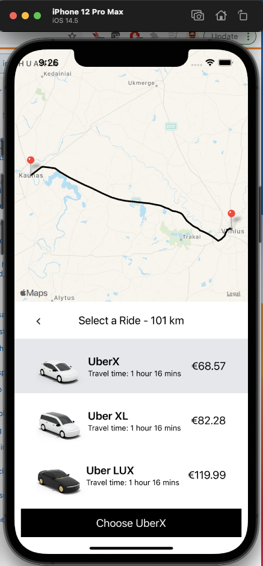

<!-- PROJECT LOGO -->

 

  <h3 align="center">README</h3>

  

    An awesome UBER CLONE app!

## .env variable
In order map to work you will need to have GOOGLE_MAPS_APIKEY in the .env file;

# yarn install
start from scratch
#npm run ios or npm run android
start virtual simulator

